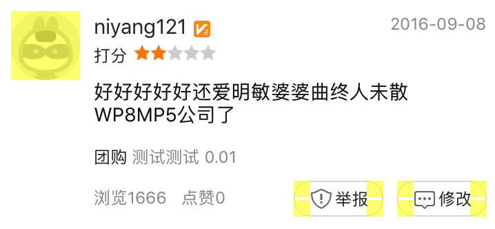
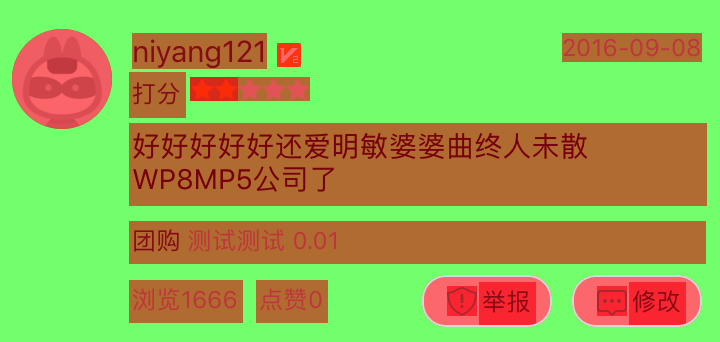
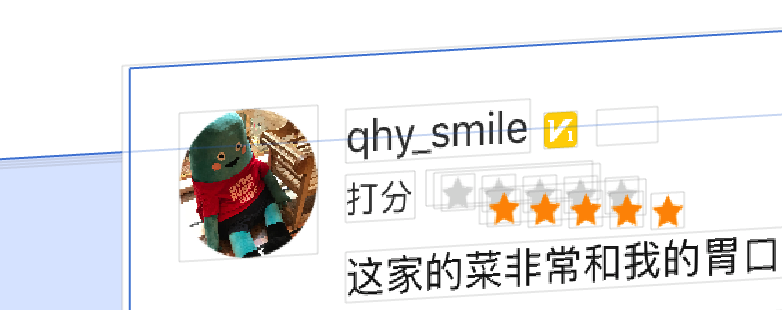
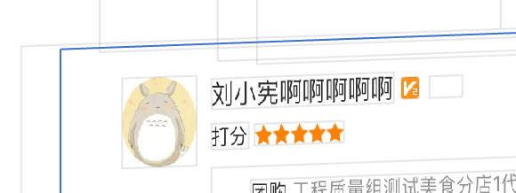

## 口碑列表页卡顿优化实战

最近做的口碑列表页开发时间比较短，完了后测了一下帧率发现最慢到40，额。。。好吧，要改

主要从下面三个方面入手：

- 避免所有cell中出现的Blended Layers（图层混合）Offscreen-Rendered（离屏渲染），把之前用10个星星图片组成的打分控件用layer重写
- 把TableView的预估行高去掉，使用手动计算行高，添加行高缓存（使用FDTemplateCell）
- 使用frame重写cell内部元素布局

<!-- more -->

就做了这些老生常谈的点，帧率就稳定在58以上了，无论滑动多快都十分丝滑（貌似跟我6s手机也有关系，哈哈）。感觉没啥要写的了，额说好的要总结个wiki的呢，就这！！！？   额  好吧  罗列一下

### 一 、解决view圆角导致离屏渲染

头像和两个button使用了圆角，使用Layer画出来


加圆角是个很常见的功能，把他放到UIView的分类中比较合适，下面的代码可以参考
```c++
/**
 * 使用mask layer画出一个园，代替使用圆角是头像图片变园
 */
- (void)setCicular
{
    UIBezierPath *maskPath = [UIBezierPath bezierPathWithRoundedRect:self.bounds byRoundingCorners:UIRectCornerAllCorners cornerRadii:self.bounds.size];
    CAShapeLayer *maskLayer = [[CAShapeLayer alloc]init];
    maskLayer.frame = self.bounds;
    maskLayer.path = maskPath.CGPath;
    self.layer.mask = maskLayer;
}

// ----- 下面是button加圆角

/**
 * 在分类中关联个属性存储圆角layer
 */
- (CAShapeLayer *)_getRadiusLayer
{
    CAShapeLayer *layer = objc_getAssociatedObject(self, &UIBUttonRadiusLayer);
    if (!layer) {
        layer = [[CAShapeLayer alloc] init];
        [self.layer addSublayer:layer];
        objc_setAssociatedObject(self, &UIBUttonRadiusLayer, layer, OBJC_ASSOCIATION_RETAIN_NONATOMIC);
    }
    return layer;
}

/**
 * 设置一下cornerRadius(上面栗子腮红是UIButtton高度的一半)
 */
- (void)cornerRadius:(CGFloat)cornerRadius borderColor:(UIColor *)color
{
    UIBezierPath* path = [UIBezierPath bezierPathWithRoundedRect:self.bounds byRoundingCorners:UIRectCornerAllCorners cornerRadii:CGSizeMake(cornerRadius, cornerRadius)];
    path.lineWidth  = 0.5f;
    CAShapeLayer *layer = [self _getRadiusLayer];
    layer.path = path.CGPath;
    layer.strokeColor = color.CGColor;
    layer.fillColor = [UIColor clearColor].CGColor;
}
```
### 二 、解决文字背景透明导致的图层混合问题

button上有一个透明部分的图片，这种没有改，因为要麻烦UI重新出白色背景版本的图，而且带来的收益并不大



文字UILable的背景色是透明的，所以捏GPU会等他下面图层搞好了在最后算出一个效果，所以捏会导致性能问题，UILable的背景设置成纯白色就好了，but Label汉字layer有一个莫名奇妙的padding是透明的要设置一下mark。就是所有label都加下面两句话

```objective-c
someLabel.layer.masksToBounds = YES;
someLabel.backgroundColor = [UIColor whiteColor];
```

### 三、把星星控件用layer重写

之前的星星控件用十个imageView组合起来，没有必要，并且导致cell的子view的复杂（这个带来的性能影响我感觉没啥，也没有针对这个测试）



这个就是把image画到layer上，改好后就是这样啦


### 四、放弃使用TableView预估行高，使用代理计算。添加行高缓存
在开发进行一般在做回复评价控制键盘在当前评论view下面，以及回复完刷新回复列表的时候就想放弃使用预估行高，预估的不准确会导致相同的offset看到的内容不一样，正好在调性能的时候把他做掉，哈哈。添加行高缓存使用FDTemplateCell，这个真没必要自己写一个，还是用牛人写好的吧，FD使用sizefit的方式计算cell高度。
### 五、使用frame重写cell内部元素布局
真正带来帧率稳定降低的优化就是这一点，用frame的方式在cell更新数据的时候确定元素内布局真的又快又好，代码比masonry更好看，更优雅，而且可变动性强，可扩展性高，真的找不到拒绝使用frame的理由

